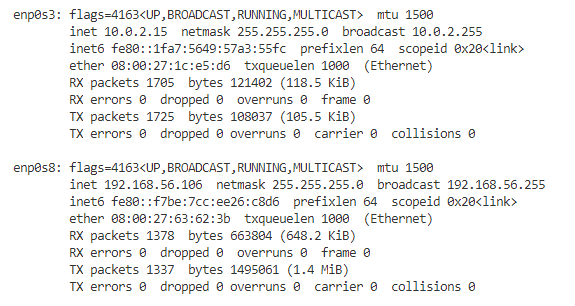
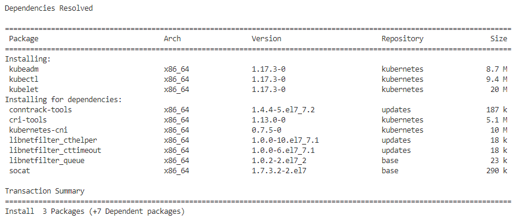

# ai-install-k8s
This repo contains guide to set up a Kubernetes environment (V1.17.2) with one master and one worker node.  Running on Virtualbox VMs.


## 1. Preparation

### 1.1 Install CentOS 7 VM

Create Virtualbox VM (Master):
- 4G ram
- 4 CPU
- Network: NAT + Host Only
- CentOS 7 (Minimal install)


### 1.2 Set Network

Update networks, run
```bash
vi /etc/sysconfig/network-scripts/ifcfg-enp0s3
```
set ONBOOT=yes


```
vi /etc/sysconfig/network-scripts/ifcfg-enp0s8
```

set ONBOOT=yes

For example:


Run `systemctl restart network` to restart network


Then Run `ifconfig` or `ip addr` to check the ip address



> Note: For minimal CentOS, please run `yum install -y net-tools` in order to use ifconfig


### 1.3 Update system

Connect to SSH, Run
```bash
yum install -y wget

wget -O /etc/yum.repos.d/CentOS-Base.repo http://mirrors.aliyun.com/repo/Centos-7.repo

yum clean all
yum makecache

yum update
```

### 1.4 Disable SELinux

Set SELinux in permissive mode (effectively disabling it), Run
```bash
setenforce 0
sed -i 's/^SELINUX=enforcing$/SELINUX=permissive/' /etc/selinux/config
```

### 1.5 Disable Swap

You MUST disable swap in order for the kubelet to work properly.
```bash
# comment out swap
vi /etc/fstab
```


```
swapoff -a
```

### 1.6 Disable Firewall
Run
```bash
systemctl stop firewalld && systemctl disable firewalld
```

### 1.7 sysctl iptables

You should ensure net.bridge.bridge-nf-call-iptables is set to 1 in your sysctl config, e.g.
```bash
cat <<EOF > /etc/sysctl.d/k8s.conf
net.bridge.bridge-nf-call-ip6tables = 1
net.bridge.bridge-nf-call-iptables = 1
EOF

sysctl --system
```


### 1.8 br_netfilter
Make sure that the br_netfilter module is loaded. 

```bash
modprobe br_netfilter
lsmod | grep br_netfilter
```


## 2. Install Container Runtime

Please follow the offical docker installation guide, the current version installed is 19.03
```bash
yum install -y yum-utils \
  device-mapper-persistent-data \
  lvm2

# use aliyun repo
yum-config-manager --add-repo http://mirrors.aliyun.com/docker-ce/linux/centos/docker-ce.repo

yum install docker-ce docker-ce-cli containerd.io
```

```bash
# Create /etc/docker directory.
mkdir /etc/docker

# Setup daemon.
cat > /etc/docker/daemon.json <<EOF
{
  "exec-opts": ["native.cgroupdriver=systemd"],
  "log-driver": "json-file",
  "log-opts": {
    "max-size": "100m"
  },
  "storage-driver": "overlay2",
  "storage-opts": [
    "overlay2.override_kernel_check=true"
  ],
  "registry-mirrors": ["http://hub-mirror.c.163.com"]
}
EOF

mkdir -p /etc/systemd/system/docker.service.d

# Restart Docker
systemctl daemon-reload
systemctl restart docker

systemctl enable docker
```


## 3. Installing kubeadm, kubelet and kubectl

Add the repo (aliyun)
```
cat <<EOF > /etc/yum.repos.d/kubernetes.repo
[kubernetes]
name=Kubernetes
baseurl=http://mirrors.aliyun.com/kubernetes/yum/repos/kubernetes-el7-x86_64
enabled=1
gpgcheck=0
repo_gpgcheck=0
gpgkey=http://mirrors.aliyun.com/kubernetes/yum/doc/yum-key.gpg
        http://mirrors.aliyun.com/kubernetes/yum/doc/rpm-package-key.gpg
EOF
```

Start install kubeadm, kubelet and kubectl
```
yum install -y kubelet kubeadm kubectl --disableexcludes=kubernetes

systemctl enable --now kubelet
```

The current version installed is V1.17.3




## 4. Copy master to create node VM

Full Copy Master to create node VM, make sure the mac address is re-generated.

### 4.1 Change Host Name

master VM:
```bash
hostnamectl set-hostname aiden-kube-master
```

node VM:
```bash
hostnamectl set-hostname aiden-kube-node
```

### 4.2 Change Hosts

Run `ifconfig` or `ip addr` to check the ip address for node VM, here the node IP is 192.168.56.105.

Update /etc/hosts, run
```bash
cat >> /etc/hosts << EOF
192.168.56.106  aiden-kube-master
192.168.56.105   aiden-kube-node
EOF
```


## 5. Initialize Master Node
```bash
# If docker is not started, run `systemctl start docker` first
kubeadm init \
    --apiserver-advertise-address=192.168.56.106 \
    --image-repository registry.aliyuncs.com/google_containers \
    --kubernetes-version v1.17.3 \
    --pod-network-cidr=192.168.0.0/16
```

Then follow the guide in the output message, run
```bash
mkdir -p $HOME/.kube
sudo cp -i /etc/kubernetes/admin.conf $HOME/.kube/config
sudo chown $(id -u):$(id -g) $HOME/.kube/config
```


Run `kubectl get pods --all-namespaces`


> Note, the coredns pod will be in pending status

Enable schedules on master node (Optional), run:
```bash
kubectl taint nodes --all node-role.kubernetes.io/master-
```

> By default, your cluster will not schedule Pods on the control-plane node for security reasons.


## 6. Install CoreDNS add-on

On Master VM, we are going to use `Calico` as the CoreDNS provider. 

> By default, Calico uses 192.168.0.0/16 as the Pod network CIDR, For Calico to work correctly, you need to pass this same CIDR to the kubeadm init command using the --pod-network-cidr=192.168.0.0/16 flag or via the kubeadm configuration.

To install Calico, run:
```bash
kubectl apply -f https://docs.projectcalico.org/v3.11/manifests/calico.yaml
```


Check all the pods again:

```bash
kubectl get pods --all-namespaces
```


And once the CoreDNS Pod is up and running, you can continue by joining your nodes.


## 7. Joining the node

On node VM, Run
```bash
scp root@aiden-kube-master:/etc/kubernetes/admin.conf /etc/kubernetes/

mkdir -p $HOME/.kube
sudo cp -i /etc/kubernetes/admin.conf $HOME/.kube/config
sudo chown $(id -u):$(id -g) $HOME/.kube/config
```


To join to the master, run:
```bash
kubeadm join 192.168.56.106:6443 --token j2qfct.tnam91v7i2wqdgc9 \
    --discovery-token-ca-cert-hash sha256:29db0966131178a76906f7db8d17210693dc0c093b060869085caa99b8434a67
```

> This is the output of `kubeadm init` on master VM. 


Then check the nodes and pods.
```
kubectl get nodes -o wide

kubectl get pods --all-namespaces
```


Now we can see two nodes, one master and one worker node.  The installation is completed.